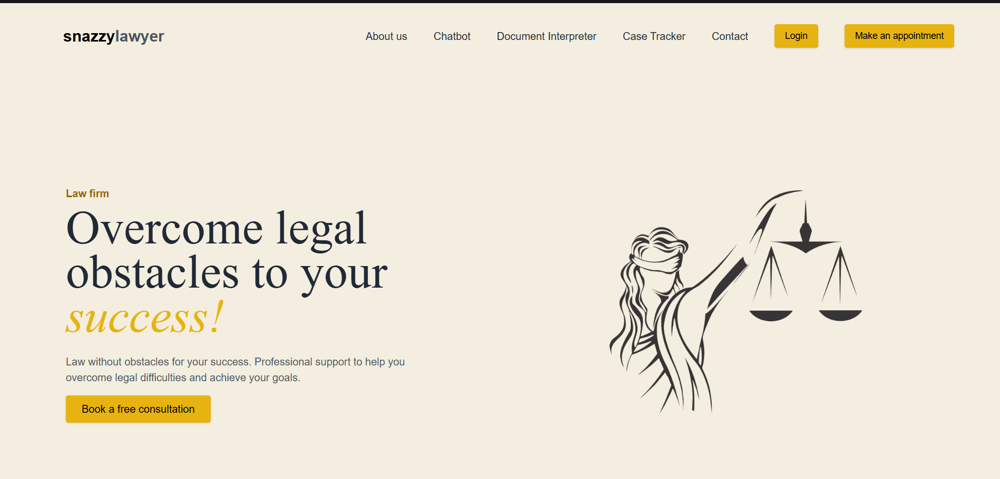
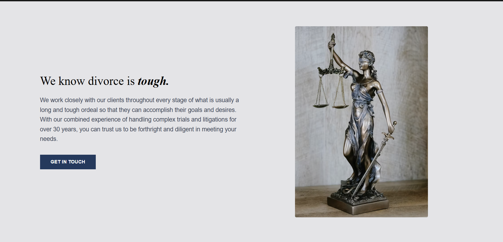

# ⚖️ Lawgic

**Lawgic** is a responsive and interactive web application built using React. It offers a clean UI, organized component-based structure, and seamless routing for smooth navigation across different sections.

---

## 🚀 Features

- 🔧 Built with React components
- 📁 Page-to-page navigation using React Router
- 📱 Fully responsive for all screen sizes
- ✨ Interactive and modern UI for an engaging user experience
- 🧩 Clean code structure and modular design

---

## 🛠️ Tech Stack

- **Frontend:** React.js, JSX, CSS
- **Routing:** React Router DOM
- **Responsive Design:** CSS Flexbox/Grid or Media Queries *(based on your setup)*
- *(Add any additional tools or libraries you used, like Tailwind, Bootstrap, etc.)*

---

## 📸 Screenshots

*(Add screenshots here once you have them)*  
You can use the following Markdown to add them:

```markdown




## Clone the repo:
```bash
git clone git@github.com:kakusingh120/Dhoom-Coder.git
cd Dhoom-coder
```


## Install dependencies:
```bash
npm install
```

## Start the development server:
```bash
npm run dev
```


## 📌 Future Improvements
- Adding backend integration

- Implementing authentication and user roles

- Enhancing animations and transitions

- Dark mode toggle